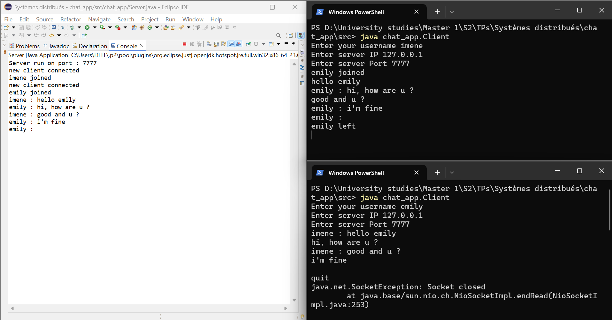

# Java TCP Chat Application

This is a simple terminal-based chat application built with Java using TCP sockets.
It allows multiple clients to connect to a central server and chat with each other in real-time.

---

## Project Structure

- `Server.java` – Accepts clients, handles each one in a separate thread, and broadcasts messages to all connected clients.
- `Client.java` – Connects to the server, sends messages typed by the user, and displays messages received from other clients.

---

## Features

- Real-time message broadcasting to all connected clients
- Parallel handling of multiple clients using threads
- Username-based message identification
- Graceful client disconnection using "quit"

---

## How to Run


### 1. Compile the code
```bash
javac Server.java Client.java
```

### 2. Run the server
```bash
java Server
```

By default, it listens on port `7777`.

### 3. Run one or more clients
```bash
java Client
```

You will be prompted to enter:
- Username
- Server IP (e.g., `localhost`)
- Server port (e.g., `7777`)

### 4. Type `quit` to disconnect.

---

## Technologies Used

- Java SE
- TCP Sockets (java.net.Socket, ServerSocket)
- Multithreading (Thread class)
- Stream I/O (BufferedReader, PrintWriter)

---

This project was implemented as part of a distributed systems TP (travaux pratiques).

